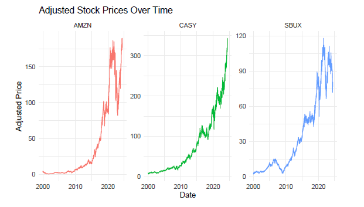
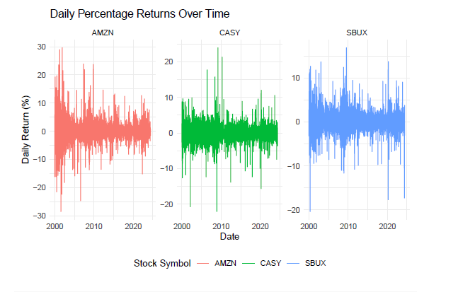

# ECOM Stocks Analysis (SBUX, AMZN, CASY)

## Summary

This analysis evaluates the stock performance of Starbucks Corporation (SBUX), Amazon.com, Inc. (AMZN), and Casey’s General Stores, Inc. (CASY) from January 2000 onwards. The report includes data import, time series analysis, return calculations, statistical summaries, hypothesis testing, correlation analysis, and portfolio optimization to provide insights and recommendations for potential investors.

## Motivation

The motivation behind this analysis is to understand the historical performance and risk-return characteristics of these three stocks. By analyzing their price trends, returns, and correlations, we aim to provide evidence-based recommendations for constructing an optimal investment portfolio.

## Purpose

The purpose of this report is to:
- Import and visualize stock price data over time.
- Calculate and plot daily returns for each stock.
- Create histograms and summary statistics of the returns.
- Perform hypothesis tests to determine the statistical significance of the returns.
- Analyze the correlations between the stocks.
- Optimize a stock portfolio based on return and risk preferences.
- Provide actionable investment advice based on the analysis.

## Summary Findings

### Data Import and Visualization
- Imported stock data for SBUX, AMZN, and CASY from January 2000.
- Visualized adjusted stock prices over time, highlighting key trends and events affecting each stock.

### Return Calculations
- Calculated daily percentage returns for each stock.
- Plotted daily returns to visualize volatility and trends.

### Statistical Summaries
- Created histograms for daily returns using the Freedman-Diaconis rule for bin selection.
- Summarized key statistics: mean, median, variance, standard deviation, skewness, and kurtosis.

### Hypothesis Testing
- Tested if average returns are significantly different from zero using one-sample t-tests.
  - SBUX and CASY showed significant average returns, while AMZN did not at the 1% significance level.
- Compared mean returns between pairs of stocks using two-sample t-tests.
  - No significant differences in mean returns between any pairs at the 1% level.

### Correlation Analysis
- Calculated and presented the correlation matrix for daily returns.
- Analyzed the strength and direction of correlations between stocks.

### Portfolio Optimization
- Optimized portfolio weights to maximize return and minimize risk.
- Recommended a portfolio of CASY and SBUX with weights approximately 52.22% and 47.78%, respectively, as it offered the highest return-to-risk ratio.

### Recommendations
- Based on the analysis, the portfolio consisting of CASY and SBUX is recommended for investors seeking a balance between return and risk.
